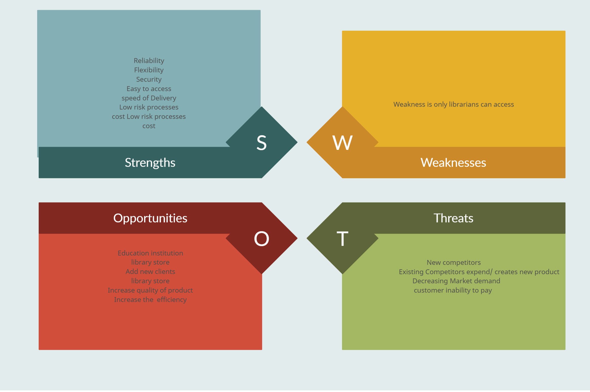

## Requirements
 
 

## Introduction:
 

Library management system is a simple application using c programming language.A Library management system  uses to maintain the record of the library. ... Library Management Systems is software that helps to maintain a database that is useful to enter new books & record books borrowed by the members, with the respective submission dates.It is complied in Visual Studio code using GCC compiler.

## Features
 

The Key features of Library management system are:
1.Online access
2.To track the movement of books
3.To digitally keep track of what is available in the library

## Language & IDE
 

1.C
 
2.Visual studio Code
 

## SWOT Analysis:

4W's and 1H
--------------------------------------------------------------------------------

Who
---------------------------------------------------------------------------------
 user can access the library management system .

What
---------------------------------------------------------------------------------
The project is main aim is to Online access and to digitally keep track of what is available in the library. 

When
---------------------------------------------------------------------------------
 user can access the library management system because the  is based on c language.

Why
---------------------------------------------------------------------------------
The project is mainly about  librarians can access and digitally keep track of what is available in the library on c.

How
--------------------------------------------------------------------------------
The user can take the library management system by entering his book name.
--------------------------------------------------------------------------------

